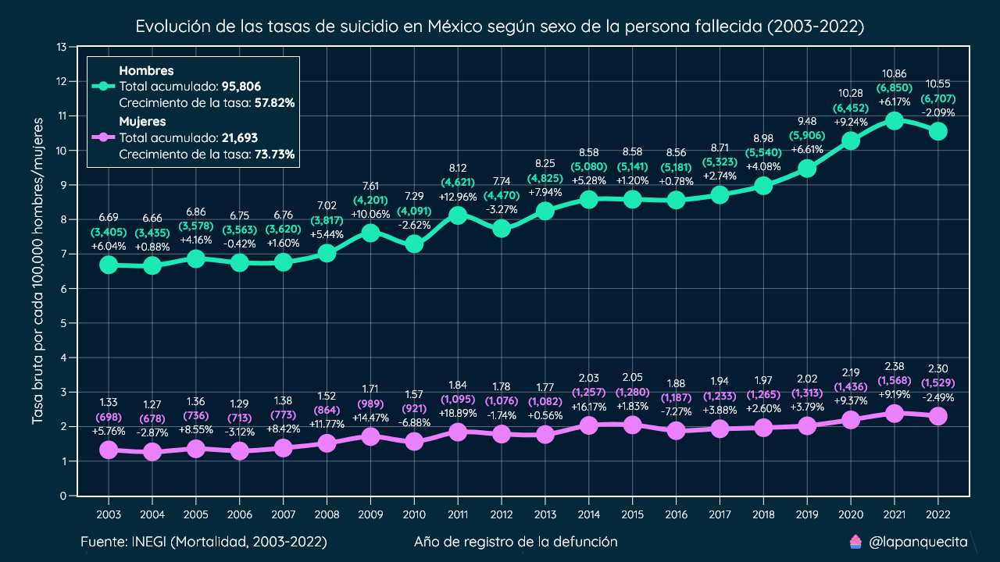

# Población estimada de México

En este repositorio se encuentran el script y datasets para extraer la población estimada de México de 1950 a 2070.

Los datasets corresponden a la estimación del CONAPO, los cuales contienen registros por año, edad, sexo, entidad federativa y municipio.

El dataset por entidades federativas fue obtenido de la siguiente direccción (Población a mitad de año, 1950-2070):

https://datos.gob.mx/busca/dataset/proyecciones-de-la-poblacion-de-mexico-y-de-las-entidades-federativas-2020-2070

El dataset de municipios se puede encontrar al navegar por el siguiente archivo PDF del CONAPO:

https://www.gob.mx/cms/uploads/attachment/file/915066/BD_municipales_portada_regiones.pdf

Estos estimados se utilizan para calcular tasas demográficas, como la de mortalidad, natalidad, nupcialidad, etc.

Al utilizar tasas en lugar de cifras absolutas se pueden hacer comparaciones más justas y objetivas como las del siguiente ejemplo.


Existen 5 conjuntos de datos en este repositorio:

* poblacion_entidad: Son las cifras de población general de hombres, mujeres y total de 1970 a 2070 por entidad federativa.

* poblacion_municipal: Son las cifras de población general de hombres, mujeres y total de 1990 a 2040 por municipio.

* poblacion_adulta_entidad: Similar al anterior, la diferencia es que en estos datos solo se contempla la población de 18 años o más.

* poblacion_edad_nacional: Son las cifras de población de hombres, mujeres y total por edad, de 0 a 109 años. Estas cifras son de la población de México de 1950 a 2070.

* poblacion_quinquenal: Esta es muy similar a la anterior, la diferencia es que las edades se encuentran agrupadas en rangos de 5 años.

## Procesamiento y uso

Los datasets que proporciona el CONAPO contienen cientos de miles de registros. Procesarlos todos para cada consulta puede alentar nuestro ritmo de trabajo.

El objetivo de este repositorio es transformar estos registros en formatos resumidos y de fácil uso. Esto se logró utilizando la librería `pandas`.

En el archivo `script.py` se ha documentado cada línea de código para generar los nuevos conjuntos de datos.

El proceso fue iterar por sexo, luego iterar por entidad federativa/municipio/edad/grupo de edad y hacer agrupaciones.

Al final del proceso tendremos archivos `.csv` que nos permiten generar gráficas como la siguiente.



Hay múltiples formas de utilizar estos archivos, depende de la herramienta que se utilice. A continuación compartiré un ejemplo de como usarlos en `pandas`.

Primero necesitamos algunas cifras para ajustar, utilizaremos las cifras de mortalidad general de los años más recientes.

```python
data = {
    2013: 623599,
    2014: 633641,
    2015: 655688,
    2016: 685766,
    2017: 703047,
    2018: 722611,
    2019: 747784,
    2020: 1086743,
    2021: 1122249,
    2022: 847716,
}
```

Primero vamos a cargar el dataset de estimación de población total por entidad.

```python
# Es importante definir la primera columna como el índice.
pop = pd.read_csv("./poblacion_entidad/total.csv", index_col=0)

# Seleccionamos la primera fila, la cual corresponde a la República Mexicana.
pop = pop.iloc[0]

# El nuevo índice son cadenas, hay que convertirlas a ints.
pop.index = pop.index.astype(int)
```

Ya que tenemos nuestra población cargada, debemos convertir los datos de mortalidad a un `DataFrame`.

```python
# Convertimos el diccionario a DataFrame.
df = pd.DataFrame.from_dict(data, orient="index")

# Renombramos la única columna.
df.columns = ["total"]

# Agregamos la población. El truco es que ambos índices son ints y pandas
# sabe como emparejarlos de forma inteligente.
df["pop"] = pop

# Calculamos la tasa por cada 100 mil habitantes.
df["tasa"] = df["total"] / df["pop"] * 100000
```

Al imprimir este nuevo `DataFrame` nos mostrará el siguiente resultado.

|      |     total |         pop |   tasa |
|-----:|----------:|------------:|-------:|
| 2013 |   623,599 | 119,597,654 |    521 |
| 2014 |   633,641 | 121,048,604 |    523 |
| 2015 |   655,688 | 122,368,490 |    536 |
| 2016 |   685,766 | 123,587,407 |    555 |
| 2017 |   703,047 | 124,777,172 |    563 |
| 2018 |   722,611 | 125,995,825 |    574 |
| 2019 |   747,784 | 127,215,666 |    588 |
| 2020 | 1,086,743 | 128,209,170 |    848 |
| 2021 | 1,122,249 | 128,982,939 |    870 |
| 2022 |   847,716 | 129,960,600 |    652 |

Este método es similar en R, Julia o Excel.

## Comparación y validación

El INEGI utiliza estas mismas cifras para realizar sus análisis demográficos. Es importante validar si nuestros resultados coinciden ya que siempre puede existir algún error en el proceso de la transformación de los datos.

### Tasa bruta de mortalidad por cada 100k habitantes

|      |     Total |   INEGI |   🧁 |   Diferencia |
|-----:|----------:|--------:|----:|-------------:|
| 2013 |   623,599 |     521 | 521 |            0 |
| 2014 |   633,641 |     523 | 523 |            0 |
| 2015 |   655,688 |     536 | 536 |            0 |
| 2016 |   685,766 |     555 | 555 |            0 |
| 2017 |   703,047 |     563 | 563 |            0 |
| 2018 |   722,611 |     574 | 574 |            0 |
| 2019 |   747,784 |     588 | 588 |            0 |
| 2020 | 1,086,743 |     860 | 848 |          -12 |
| 2021 | 1,122,249 |     879 | 870 |           -9 |
| 2022 |   847,716 |     659 | 652 |           -7 |

Fuente: https://www.inegi.org.mx/contenidos/saladeprensa/boletines/2023/EDR/EDR2022-Dft.pdf

En este caso todas las cifras coinciden excepto para los años 2020, 2021 y 2022. El INEGI menciona que a partir del 2020 utilizan sus propias estimaciones.

Algo que podemos notar es que la diferencia en el 2020 es mayor a la del 2022, lo que podría signfiicar que en un futuro las estimaciones convergerían.

### Tasa de natalidad por cada 1,000 mujeres de 15 a 49 años de edad

|      |       Total |   INEGI |    🧁 |   Diferencia |
|-----:|------------:|--------:|-----:|-------------:|
| 2013 | 2,478,889 |    75.5 | 75.5 |          0.0 |
| 2014 | 2,463,420 |    74.2 | 74.2 |          0.0 |
| 2015 | 2,353,596 |    70.1 | 70.1 |          0.0 |
| 2016 | 2,293,708 |    67.7 | 67.7 |          0.0 |
| 2017 | 2,234,039 |    65.4 | 65.4 |          0.0 |
| 2018 | 2,162,535 |    62.8 | 62.8 |          0.0 |
| 2019 | 2,092,214 |    60.3 | 60.3 |          0.0 |
| 2020 | 1,629,211 |    47.9 | 46.7 |         -1.2 |
| 2021 | 1,912,178 |    55.6 | 54.4 |         -1.2 |
| 2022 | 1,891,388 |    54.5 | 53.5 |         -1.0 |

Fuente: https://www.inegi.org.mx/contenidos/saladeprensa/boletines/2023/NR/NR2022.pdf

Similar al ejemplo anterior, la diferencia comienza a partir del año 2020.

### Tasa de matrimonios por cada 1,000 habitantes de 18 años o más de edad

|      |     Total |   INEGI |   🧁 |   Diferencia |
|-----:|----------:|--------:|----:|-------------:|
| 2013 | 583,246 |     7.5 | 7.5 |          0.0 |
| 2014 | 577,713 |     7.2 | 7.2 |          0.0 |
| 2015 | 558,022 |     6.9 | 6.9 |          0.0 |
| 2016 | 543,749 |     6.6 | 6.6 |          0.0 |
| 2017 | 528,678 |     6.3 | 6.3 |          0.0 |
| 2018 | 501,298 |     5.9 | 5.9 |          0.0 |
| 2019 | 504,923 |     5.8 | 5.8 |          0.0 |
| 2020 | 335,563 |     3.8 | 3.8 |          0.0 |
| 2021 | 453,085 |     5.1 | 5.1 |          0.0 |
| 2022 | 507,052 |     5.7 | 5.6 |         -0.1 |

Fuente: https://www.inegi.org.mx/contenidos/saladeprensa/boletines/2023/EstMat/Matrimonios2022.pdf

En este caso solamente el 2022 presentó una diferencia marginal. Para calcular esta tasa se utilizaron los datos del directorio `poblacion_adulta_entidad`.

### Tasa bruta de suicidios por cada 100k habitantes

|      |    Total |   INEGI |    🧁 |   Diferencia |
|-----:|---------:|--------:|-----:|-------------:|
| 2017 | 6,576 |     5.3 | 5.3 |          0.0 |
| 2018 | 6,795 |     5.4 | 5.4 |          0.0 |
| 2019 | 7,210 |     5.7 | 5.7 |          0.0 |
| 2020 | 7,902 |     6.2 | 6.2 |          0.0 |
| 2021 | 8,422 |     6.5 | 6.5 |          0.0 |
| 2022 | 8,125 |     6.3 | 6.3 |          0.0 |

Fuente: https://www.inegi.org.mx/contenidos/saladeprensa/aproposito/2023/EAP_Suicidio23.pdf

En este caso no existe ninguna diferencia entre las tasas del INEGI y las que calculamos.

## Población municipal

Con una estrategia similar a la utilizada en la extracción de cifras por entidad, es posible tener la población estimada por municipio desde el año 1990 hasta el año 2040.

Tener las cifras de población por municipio nos permite desarrollar mapas con mayor precisión.


## Conclusión

A pesar de las ligeras diferencias entre las estimaciones del CONAPO y el INEGI, recomiendo utilizar las estimaciones de este proyecto para calcular las tasas demográficas y otros análisis.

Estaré monitoreando cambios en los archivos del CONAPO y actualizaré los conjuntos de datos de manera oportuna.


